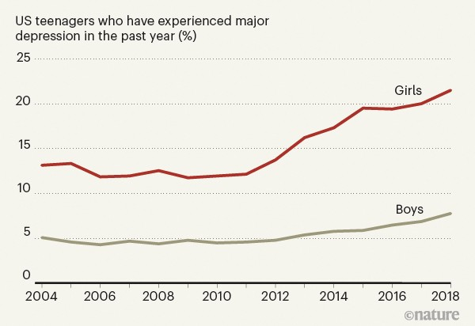
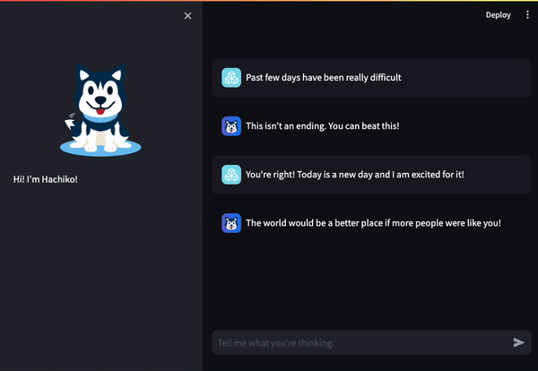

# Hachiko's Journal (1st Place for Health Hack Category in HackRU 2020)

## Inspiration

Mental health includes our emotional, psychological, and social well-being. It affects how we think, feel, and act. It also helps determine how we handle stress, relate to others, and make choices. Mental health is important at every stage of life, from childhood and adolescence through adulthood.



*Nature,* Jonathan Haidt & Nick Allen (2020). *[Scrutinizing the effects of digital technology on mental health](https://www.nature.com/articles/d41586-020-00296-x).*

The percentage of young Americans experiencing certain types of mental health disorders has risen significantly over the past decade, and the COVID-19 pandemic lockdown only made things worse.

One of the ways to deal with mental health problems is to find a healthy way to express ourselves. This makes a journal a helpful tool in managing mental health. Journaling can help:

- Manage anxiety
- Reduce stress
- Cope with depression

Journaling helps control symptoms and improve mood by:

- Helping prioritize problems, fears, and concerns
- Tracking any symptoms day-to-day so that we can recognize triggers and learn ways to better control them
- Providing an opportunity for positive self-talk and identifying negative thoughts and behaviors

That's where ***Hachiko's Journal*** aims to make a difference!

## What it does

Meet **Hachiko!**


**Hachiko,** the Siberian Husky is very friendly and gentle. He's a very good boy and his primary goal is to be by your side during tough times and talk to you through your journal.

***Hachiko's Journal*** is an application which aims to help users cope with mental health issues by expressing themselves through journal writing/chatting.

### Original Version

In the original version of Hachiko's Journal, submitted as in the Health Hack category of HackRU, the user writes entries into the journal, **Hachiko** reads the journal and appropriately responds with positive remarks and compliments that relate to the content of the journal.


Similarly, when the user's account is rather negative, **Hachiko** quickly detects that and provides motivating remarks for the user.


Additionally the user can navigate to past journals and read them to reminisce pleasant memories, or even play around with **Hachiko!**

Watch the [demo video for HackRU 2020!](https://youtu.be/eLksAlg7IP8)

### Current version

Hachiko's Journal has now been upgraded to a chat application with Hachiko. To run it, first install dependencies:

```bash
pip3 install -r requirements.txt
```

Then run the [Streamlit](https://streamlit.io/) application:

```bash
streamlit run app.py
```

Then head over to `http://localhost:8501` to start chatting with Hachiko!



## How I built it

***Hachiko's Journal*** was initially built as a desktop application using **PyQt5**, and later upgraded to a **Steamlit** chatbot. For natural language processing, I utilized the **Google Cloud Language** library to analyze entities and sentiments in the journal's text, and the **HuggingFace** API.

## Challenges I ran into & what I learned

Through this project, I learned of the importance of building user-friendly interfaces, especially in this specific case. As someone who hasn't done much frontend development, it was challenging to build something potentially eye-catching.

## What's next for ***Hachiko's Journal***

- Extending the set of compliments and motivators
- Cross-platform integration

### Credits

Artwork by [Manuel Corsi](https://backthemc.myportfolio.com/)
